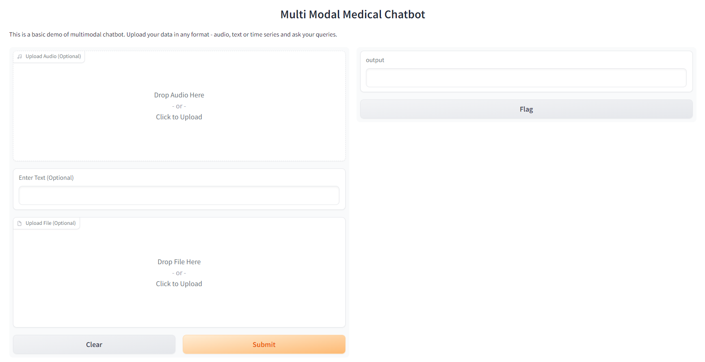

# Multimodal Medical LLama (MML) :stethoscope:
A fine tuned LLama model that accepts multimodal data as input and gives response as text. The model accepts data in text, audio and time series data (ECG Data). 


## Introduction
Multimodal language models have gained significant attention in recent years due to their ability to process diverse sources of information, such as text, speech, and time series data. This repository contains an implementation of an MLLM that leverages the power of pre-trained language models to perform various tasks across multiple modalities.

## How It Works :bulb:
Upload your audio, ECG data, or type in your medical query in the provided input fields.

The chatbot will process your input using cutting-edge machine learning models.

Based on the input, the chatbot will generate a response just like a real doctor would, providing valuable medical insights and advice.

The output will be displayed in the text box, allowing you to have a seamless conversation with the chatbot.

## Installation
- Clone the repository:
```git clone https://github.com/your-username/multimodal-language-model.git```
```cd multimodal-language-model```
- Create a virtual environment (optional but recommended):
```python -m venv venv```
```source venv/bin/activate```
- Install the required dependencies:
```pip install -r requirements.txt```

## Training 
- For training the CNN architecture for Multilabel data classification (ECG). 
  - Download the data from the website [Kaggle](https://www.kaggle.com/datasets/khyeh0719/ptb-xl-dataset) and place it in ```time_series/data/```
  - Run ```python time_series/train.py```
- For fine-tuning the LLama Model (GPU Required). 
  - Download the instruction tuned dataset and place it in ```llm/dataset/```
  - Run ```python llm/training.py```

## Inferencing 
- For inferencing the model run ```python inference.py```


## Demo 
The projects support a Gradio based GUI.



## Sample Responses 

- **Q1** - Over the past few weeks, I've been experiencing a constant, dull pain under my ribs, and
it's been accompanied by significant weight loss. Additionally, I noticed tiny black fragments in
my urine after a recent ultrasound, but I haven't experienced any other symptoms. What could
be causing these symptoms, especially the black particles in my urine?

  **MM LLama** - Hi! Good evening. I am Chat Doctor answering your query. The black
fragments in urine can be due to bleeding from the gastrointestinal tract. It can also be due to
urinary tract infection. I would suggest that you get an abdominal ultrasound done. This will help
rule out any pathology in the gastrointestinal tract. If this is normal then you should consult a
physician and start on some antibiotics for urinary tract infection. Hope this helps. If you have
any further queries feel free to ask. Take care. Chat Doctor. Thank you. Wish you good health.
Kind regards.


- **Q2**  - During a recent check-up, the doctor found some nodules in my body. Surprisingly, they
don't cause any pain or discomfort, but I'm concerned about their presence. Can you please
explain what these nodules are and whether they require any further evaluation or treatment?

  **MM LLama** - Hi, Thanks for writing to Chat Doctor. I have gone through your query and
can understand your concerns. These nodules could be due to different causes like thyroid
nodules, enlarged lymph nodes etc. I would suggest you to consult a surgeon and get a fine
needle aspiration cytology done. This will help in finding out the nature of the nodules and plan
an appropriate management. Hope this helps. Let me know if there is any other questions. Take
care. Wish you good health


## Disclaimer :warning:
The MultiModal Medical Chatbot is designed for informational purposes only and should not be considered a substitute for professional medical advice. Always consult a qualified healthcare professional for personalized medical guidance.


